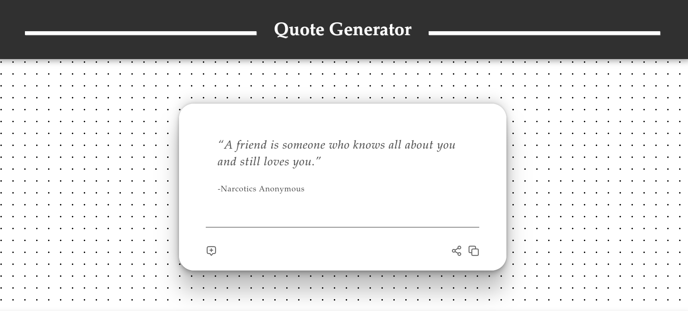

# 📜 Quote Generator

A simple and clean quote generator built with HTML, CSS, and JavaScript. This web app displays random inspirational quotes with the click of a button.

🔗 **Live Demo:** [https://osivff.github.io/quote-generator/](https://osivff.github.io/quote-generator/)

---

## ✨ Features

- 🎲 Random quote generation
- 📖 Displays quote text and author
- 🔁 New quote button to refresh content
- 🐦 "Tweet This" button to share the quote
- 💡 Clean and user-friendly UI

---

## 🛠️ Built With

- **HTML** – Structure and content
- **CSS** – Styling and layout
- **JavaScript** – Dynamic quote fetching and interactivity

---

## 📸 Screenshots

---

## 📦 Future Improvements
- Add quote categories or themes

- Use an external API for live quotes

- Add animations or transitions

- Allow custom background themes

---

## 🙌 Acknowledgments
- Quotes used are from a local list.

- Inspired by JavaScript quote generator tutorials.

---

## 📫 Contact

GitHub: @osivff